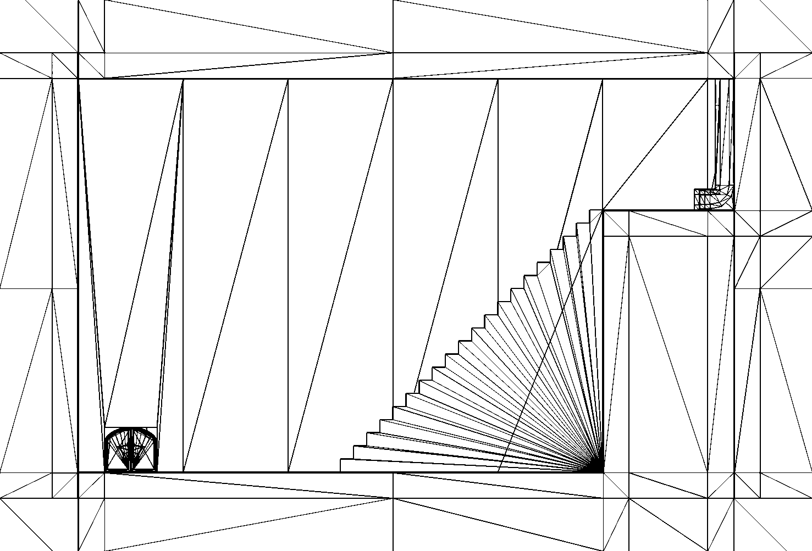
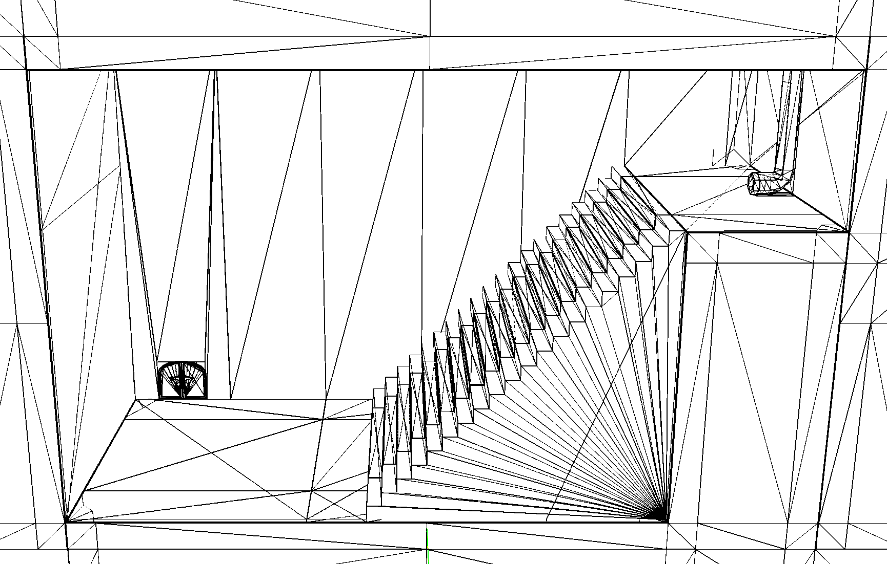
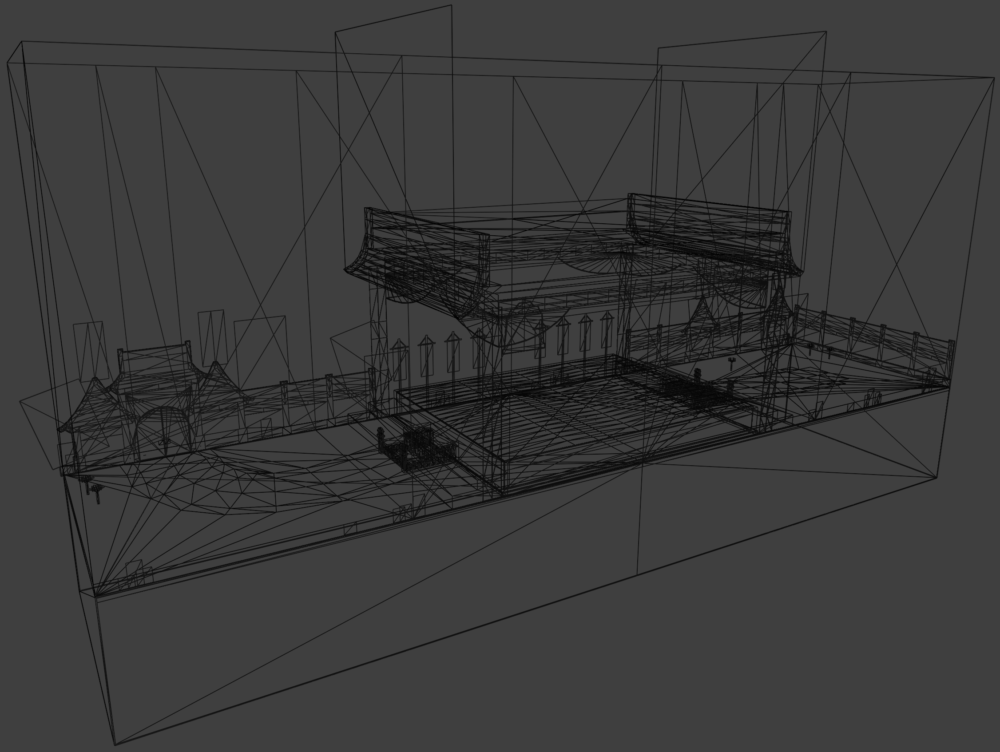

# Super Paper Mario - Level Dumper
This is a Node.js script that **reads a .wbfs archive** of Super Paper Mario **and dumps the level geometry for each level into a .obj file**, so that the levels/maps can be opened with other tools and programs, such as Blender.

**To use this script, just follow the directions below. You will provide your .wbfs file, and the script will generate a folder called "output" filled with 300+ levels in .obj format. Enjoy!**

Right now, only geometry and collision data are converted. No vertex colors/textures are applied to the models, and camera data is ignored.

In the future, I hope to create (or help to create) a new version of this tool which dumps colors, textures, camera info, animations, and more- and switch to exporting in .glTF instead of .obj format. But until then, I hope some of you find this script useful!


<!-- 

 -->

## System requirements:
- Free disk space: **1.25GB** - Only needed while the script is running (to unpack the .wbfs archive). The resulting collection of .obj files will only take up 127MB.
- OS: **Tested with x86_64 Debian-based Linux** - This script only works on Linux systems with BASH shell (ZSH probably works too). Feel free to use WSL or a VM like VirtualBox (Windows) or UTM (MacOS) if you want to run it on another system.
- Installed tools: **Node.js and Python3** - Tested and working with Node 18.13.0 and Python 3.11.2, but any realtively recent version of Node and Python should work fine. You don't need to use any package managers or install any dependencies. Just make sure Python is available in your path. (As long as you can open a terminal and type "python" or "python3" to launch the interpreter, you're all good here!)

## Usage
1. Make sure you are using Linux and that a recent copy of Node.js and Python 3 are installed
2. Obtain a .wbfs copy of Super Paper Mario (in a legitimate manor)
3. Rename the .wbfs file to "**spm.wbfs**"
4. Download this repository (and extract it if you need to), or clone it:
```shell
git clone https://github.com/BraidenPsiuk/spm-level-dumper.git
```
5. Move your **spm.wbfs** file into the root of the repository
6. Open the repo using a terminal (**cd** into it)
7. Set the following permissions on bin-utils:
```shell
sudo chmod +x ./utils/bin-utils/*
```
8. Make sure you are still inside the repo, then run the script (no need to install any dependencies first, there are none):
```shell
node ./spm-level-dumper.mjs
```
That's it! Please note that the script may take a few minutes to complete. When it's finished, you'll find all of the levels in the "output" folder in the root of the repository. You might also find [this document](https://docs.google.com/document/d/10w4CS5oNBOHHYtM9OrNUYM7GIqNxIaR-b_Sr8FSG7Pk/edit#heading=h.r3koedvnma3t) handy, it provides IDs and descriptions for each level.

Thanks to all the hard work by Andrew Ekstedt (magical), PistonMiner, Wiimm, and everyone else on the SPM/TTYD scene! Please see the "Credits" section below for more information about the scripts used in this repo.

## Troubleshooting
- If you get a **"python: not found"** error, make sure Python 3+ is installed and available in your path. You might need to open the script in an editor and change the constant "PYTHON_BIN_NAME" from "python3" to "python".
- For a **"Permission denied"** error, make sure you've first set the proper permissions on the binaries inside "./utils/bin-utils". See step 7 under "Usage" above.
- If wit produces **"ERROR #76 [CAN'T OPEN FILE]"**, you probably just need to ensure you've provided the .wbfs file as described in steps 3 and 5 under "Usage" above.

## Can I just download the .obj files from somewhere?
For legal reasons, I don't feel comfortable distributing them. Please obtain your own .wbfs copy of the game and run this script to dump the levels yourself.

## Credits
This script, simply put, is just a bunch of various community scripts hot-glued together to form one cohesive way to dump levels. I did not write any of the lower-level scripts that actually perform the raw decompression, unarchiving, and conversion. Here are the following scripts used, and their authors:
- Andrew Ekstedt's (magical's) [nlzss](https://github.com/magical/nlzss): Specifically, their [lzss3.py](https://github.com/magical/nlzss/blob/master/lzss3.py)
- PistonMiner's [ttyd-tools](https://github.com/PistonMiner/ttyd-tools): Specifically, their [ttydview.py](https://github.com/PistonMiner/ttyd-tools/blob/master/ttyd-tools/ttydview/ttydview.py)
- Wiimm's ISO and SZS tools: Specifically, their [wit](https://wit.wiimm.de/wit/) ISO manipulation tool and [wszst](https://szs.wiimm.de/wszst/) SZS tool.

I have copied and included the above scripts and binaries in this repo to make it convenient for users to download everything all at once. However, I want to make it clear that I had no part in writing any script other than *spm-level-dumper.mjs*. They are only included here in this repo for convenience and archival purposes. (If you have any problem with this, please open an issue.)

## Safety / Security
This script has two instances where it uses "rm -rf" (a destructive operation). All file paths referenced in the script are relative to the repository root, so it should be safe as long as you run the script from inside the repository folder, and don't store anything important in the repository folder. But still, use caution. To avoid potential data loss, only run scripts you've inspected yourself first.


<!--
I commented out this information as it might not all be acurate, I just typed this stuff up as I was figuring out this process. I left it here because it has a bit more useful info.

The bloated output, containing all ttydview.py files, objs, and base wbfs data takes up 1085184 bytes (1.1GB).
With all ttydview.py files removed, it takes up 1080600 bytes (still 1.1GB), so not much of a difference removing those.
With all the tmp stuff deleted, and just the obj files left, the result is only 129276 bytes (127MB!)

---
If you're just here for the .obj level files, the above information is all you need. However, if you're interested in how this all works, continue reading below!


## How to do this all manually
There are a few parts to this!
1. Grab a WBFS archive copy of Super Paper Mario
2. Extract this archive
3. Decompress the maps
4. extract the maps

## More detailed instructions:
1. Extract the wbfs rom file:
```shell
wit EXTRACT "Super Paper Mario.wbfs" ./output
```
2. Enter the files/map directory, extract each of these .bin files (we're gonna tackle just one here to test with, ) (they are LZ10 compressed, https://github.com/magical/nlzss)
```shell
python3 lzss3.py aa1_01.bin > aa1_01.lz10_extracted
```
3. (OPTIONAL) Use this command to list contents of extracted map file:
```shell
wszst list aa1_01.lz10_extracted
```
This just lets you look at the contents to make sure you can view them.
4. Now we're even closer to the finish line! Use this:
wszst extract aa1_01.lz10_extracted --dest wszst_extracted_content

Cool! Now we have some more files. But, everything is still in a weird format. Ignore the newly created "wszst-setup.txt", it's useful if we want to reconstruct the archive later, but we aren't interested in that now. (You can even delete it if you want.) Just navigate into "dvd". Lets tackle how to view textures first, then we'll figure out how to import the level geometry/mesh data into another tool... Like Blender!

5. To turn the weird .tpl texture files into usable PNGs, replace the above "extract" with "xall" (this is supposed to mean "extract all")
wszst xall aa1_01.lz10_extracted --dest wszst_extracted_content
You'll probably get ERROR #64 [FILE ALREADY EXISTS], just delete the folder previously generated and run the new "xall" command and it'll work!

Thanks to noclip.website, we can determine the map name for the very iconic "Lineland Road". This just happens to be called "he1_01.bin". If you'd like to follow along from this point but don't have access to the wbfs archive file, you can try with just this single map file by grabbing it from noclip.website's server. Download from here: https://noclip.beyond3d.com/spm/he1_01.bin Note that this file only contains a single map's texture and geometry/mesh data, and is not enough to reconstruct the actual game. Although it contains assets created by Nintendo, it shouldn't be viewed as an act of piracy, rather a means to educate by using something recognizable and graspable. If you consider this condoning piracy, consider the fact that Nintendo has not pushed for a takedown of noclip.website. It is a digital museum run and maintained by a supportive community and does not distribute the core game itself.

Anyway... now using "he1_01.bin" (Lineland Road). Let's move it to it's own isolated directory and combine what we learned above to extract it.
```shell
python3 lzss3.py he1_01.bin > he1_01.bin_DECOMPRESSED && wszst xall he1_01.bin_DECOMPRESSED --dest he1_01.bin_EXTRACTED
```

Cool. So we've got it decompressed, extracted, and now we can view textures as PNGs. But... what next? Trying to use the lzss decompression python script on "dvd/map/he1_01/map.dat" or "dvd/setup/he1_01.dat" gets us nowhere, as apparently these files aren't compressed. Maybe they're raw obj/ply files, so lets try tacking on an extension and opening them in Blender! That lets us test four possible combinations:
map.dat > map.dat.obj
map.dat > map.dat.ply
he1_01.dat > he1_01.dat.obj
he1_01.dat > he1_01.dat.ply

Do any of them result in success? Well, map.dat.obj kinda gives us some "mesh" data? We are provided with a series of vertices, but they're all located at the same position... Not very helpful. But hey, now we can count the number of vertices in the file maybe? Kind of helpful? Well, there seem to be only 7 vertices in this file so it almost certainly isn't raw level geometry. The rest of the file and importer combinations get us nowhere, they don't even produce objects in Blender. We can't drag any of these files thus far into noclip.website either. Okay! So... Let's try "ttydview.py". This script is a little quirky. It expects two folders to be created, side by side. These are called "map_data" and "obj_files". The first argument is the raw map file and the second is the output file. "map/he1_01/map.dat" is seemingly the file we are after... WOO! Lineland road appears in Blender! Granted, it isn't pretty. We don't have textures applied, but everything is there. All the data is split up into vertex groups so maybe it's possible to turn parts of it on and off. (This isn't true? I could have sworn when I first tried this, I saw a bunch of vertex groups, but now I can't seem to find that data. I don't even know if OBJ's can contain that sort of information.)

There's also still another juicy-looking file in files/setup with the same map name but with a ".dat" extension instead of ".bin". Hopefully we'll figure out what that is soon! -->
